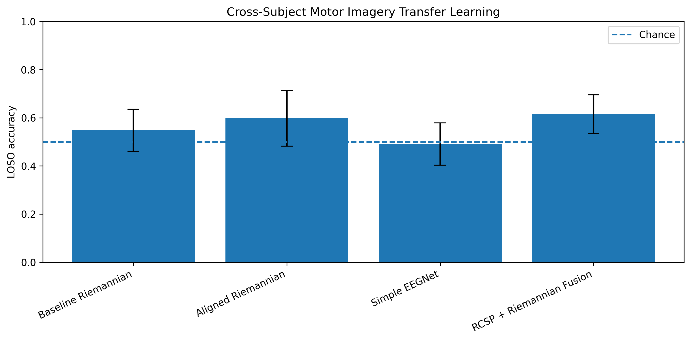
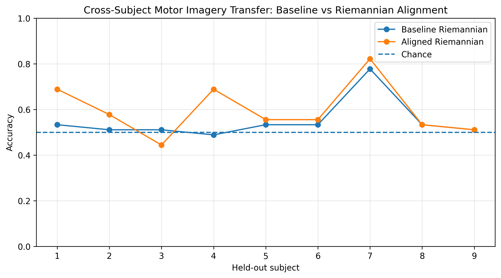
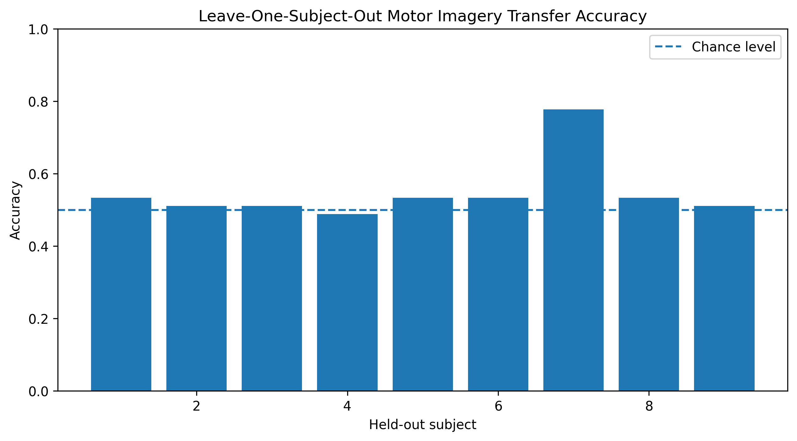

# Cross-Subject EEG Transfer Learning Using Riemannian Geometry and Spatial–Riemannian Feature Fusion

## Overview

This project investigates subject-independent EEG motor imagery decoding using transfer learning methods. The central question is whether a decoder trained on multiple subjects can generalize to a completely unseen subject.

This is a major challenge in brain-computer interfaces because EEG signals vary strongly across individuals due to differences in cortical anatomy, skull conductivity, electrode placement, and baseline oscillatory activity.

## Research Question

Can Riemannian geometry, subject-specific covariance alignment, and spatial–Riemannian feature fusion improve cross-subject motor imagery decoding?

## Dataset

The project uses the EEG Motor Movement/Imagery Dataset through MNE-Python.

| Property | Value |
|---|---|
| Subjects | 9 |
| Channels | 64 |
| Sampling Rate | 160 Hz |
| Task | Left-hand vs. right-hand motor imagery |
| Runs | 4, 8, 12 |
| Evaluation | Leave-One-Subject-Out Cross Validation |

## Methods

EEG recordings were filtered from 8–30 Hz to isolate sensorimotor rhythms associated with motor imagery. Trials were epoched from 1 to 4 seconds after cue onset.

Four models were evaluated:

| Model | Description |
|---|---|
| Baseline Riemannian | Covariance estimation, tangent space projection, logistic regression |
| Aligned Riemannian | Subject-specific covariance alignment before tangent space projection |
| Simple EEGNet | Lightweight EEGNet-inspired convolutional neural network |
| RCSP + Riemannian Fusion | Regularized CSP features concatenated with Riemannian tangent space features and classified with a linear SVM |

## Results

| Model | Mean LOSO Accuracy | Standard Deviation |
|---|---:|---:|
| Baseline Riemannian | 54.8% | 8.7% |
| Aligned Riemannian | 59.8% | 11.5% |
| Simple EEGNet | 49.1% | 8.8% |
| RCSP + Riemannian Fusion | **61.5%** | **8.1%** |

The RCSP + Riemannian fusion model achieved the best cross-subject performance, improving over the baseline Riemannian decoder by 6.7 percentage points and outperforming the EEGNet baseline by 12.4 percentage points.

## Model Comparison

## Riemannian Alignment Effect

## Baseline LOSO Subject Performance

## Interpretation

The results suggest that geometric methods are better suited than a simple deep learning baseline for small-sample cross-subject EEG transfer learning. Subject-specific covariance alignment improved generalization, indicating that inter-subject covariance shifts are a major source of performance degradation. The best performance was achieved by combining discriminative spatial filtering with Riemannian tangent space features.

## Technologies Used

- Python
- MNE-Python
- pyRiemann
- scikit-learn
- PyTorch
- NumPy
- Pandas
- Matplotlib

## Future Work

Future extensions include Tangent Space Alignment, cross-session transfer learning, cross-montage adaptation, transformer-based EEG models, and real-time decoding through Lab Streaming Layer.

## Author

Steven Andreev  
B.S. Cognitive and Behavioral Neuroscience  
Loyola University Chicago

## Academic Report

A full APA-style technical report documenting the methodology, experiments, statistical analysis, and results is included in this repository.

[Download the full APA report](reports/APA7_Full_Length_EEG_Transfer_Report.pdf)
